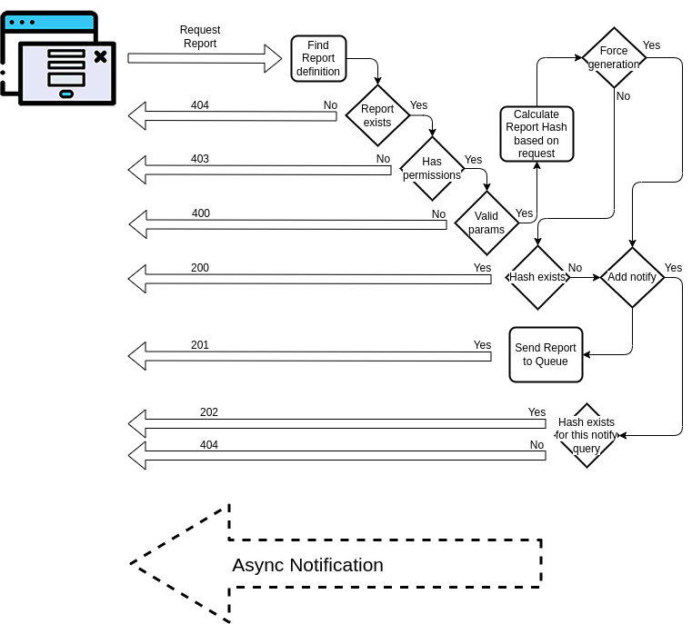
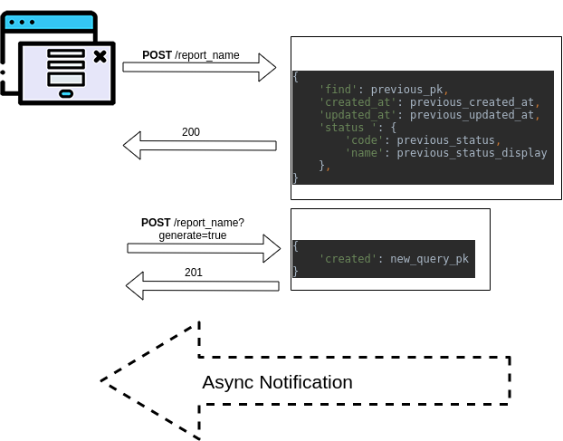

# Django easy report
Django App for generate easily reports

## API workflow
See doc as [OpenAPI format](./openapi.yml)


### Examples
* Notify me when report is done

* Regenerate new report


# Howto
1. Create your code
```python
import datetime

from django_easy_report.reports import ReportBaseGenerator
from django_easy_report.exceptions import DoNotSend

from django import forms


class MyForm(forms.Form):
    format = forms.ChoiceField(choices=[
        ('csv', 'csv'),
        ('ods', 'ods'),
        ('xls', 'xls'),
        ('xlsx', 'xlsx'),
    ])
    webhook = forms.CharField()


class MyReportGenerator(ReportBaseGenerator):
    form_class = MyForm

    def get_params(self, data):
        user_params = {'webhook': data.pop('webhook')}
        return user_params, data

    def validate(self, data):
        errors = super(MyReportGenerator, self).validate(data)
        if not errors:
            errors = dict()
        report_format = self.setup_params.get('format')
        num_rows = self.precalculate_rows()
        err_msg = 'The report need {} rows and the format do not support that size'
        if report_format == 'xls' and num_rows > self.XLS_MAX_ROWS:
            errors['format'] = err_msg
        elif report_format == 'xlsx' and num_rows > self.XLSX_MAX_ROWS:
            errors['format'] = err_msg
        elif report_format == 'ods' and num_rows > self.ODS_MAX_ROWS:
            errors['format'] = err_msg
        return errors

    def get_filename(self):
        report_format = self.setup_params.get('format')
        utc_now = datetime.datetime.utcnow()
        return "MyReport_at_{}.{}".format(
            utc_now.strftime('%Y%m%d-%M%S'),
            report_format
        )

    def get_mimetype(self):
        report_format = self.setup_params.get('format')
        if report_format == 'csv':
            return 'text/csv'
        elif report_format == 'ods':
            return 'application/vnd.oasis.opendocument.spreadsheet'
        elif report_format == 'xls':
            return 'application/vnd.ms-excel'
        elif report_format == 'xlsx':
            return 'application/vnd.openxmlformats-officedocument.spreadsheetml.sheet'
        return self.mimetype

    def generate(self):
        self.buffer.write(b'Your report data')
        # ...

    def get_message(self, report_status, requester, attachment=None, link=None):
        params = requester.get_params()
        if params:
            webhook = params.get('webhook')
            # Send information to webhook
            # ...
            raise DoNotSend
        return super(MyReportGenerator, self).get_message(report_status, requester,
                                                          attachment=attachment, link=link)

    def precalculate_rows(self):
        num_rows = 0
        # ...
        return num_rows

```

# License
Copyright 2021 Victor Torre

Permission is hereby granted, free of charge, to any person obtaining a copy of this software and associated documentation files (the "Software"), to deal in the Software without restriction, including without limitation the rights to use, copy, modify, merge, publish, distribute, sublicense, and/or sell copies of the Software, and to permit persons to whom the Software is furnished to do so, subject to the following conditions:

The above copyright notice and this permission notice shall be included in all copies or substantial portions of the Software.

THE SOFTWARE IS PROVIDED "AS IS", WITHOUT WARRANTY OF ANY KIND, EXPRESS OR IMPLIED, INCLUDING BUT NOT LIMITED TO THE WARRANTIES OF MERCHANTABILITY, FITNESS FOR A PARTICULAR PURPOSE AND NONINFRINGEMENT. IN NO EVENT SHALL THE AUTHORS OR COPYRIGHT HOLDERS BE LIABLE FOR ANY CLAIM, DAMAGES OR OTHER LIABILITY, WHETHER IN AN ACTION OF CONTRACT, TORT OR OTHERWISE, ARISING FROM, OUT OF OR IN CONNECTION WITH THE SOFTWARE OR THE USE OR OTHER DEALINGS IN THE SOFTWARE.
